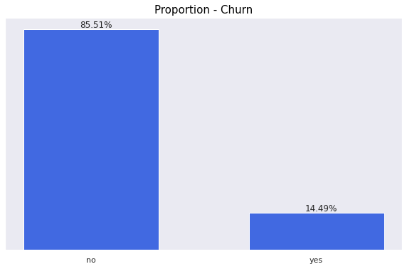
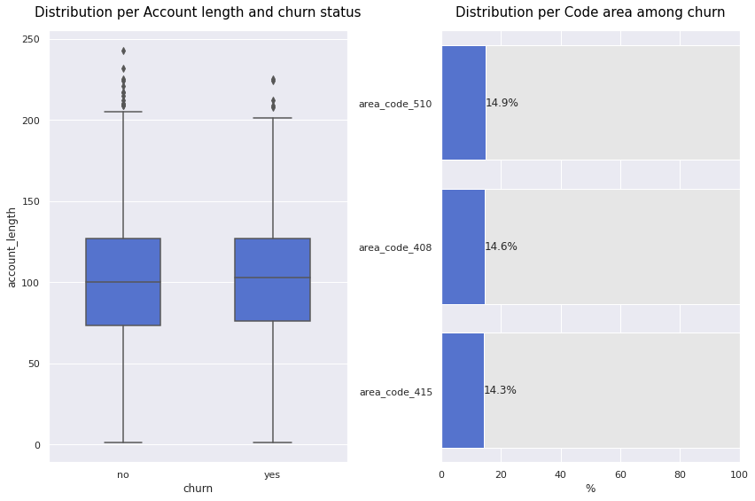
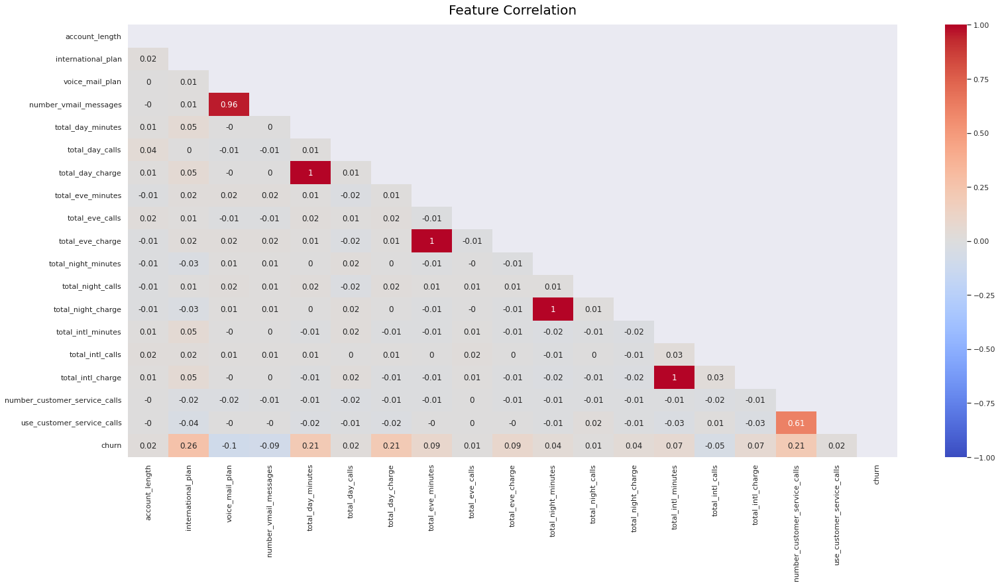
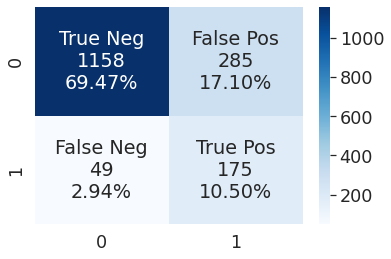
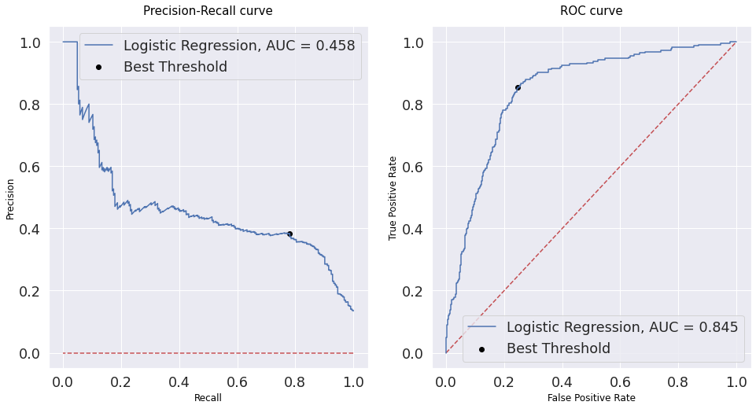
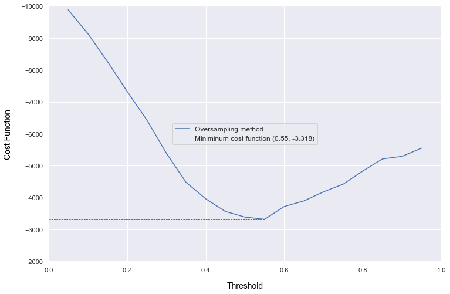
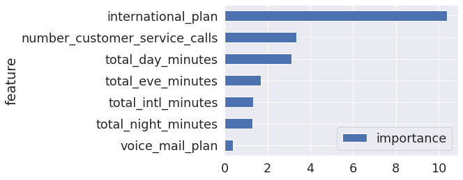

# Telecom Customer Churn Prediction with Logistic Regression

 

 </img>
</img>

**This is part of the second training course of https://www.datascienceacademy.com.br/ Data Scientist program.**

 

## Problem Context

**Customer Churn** refers to the imminent possibility of a client stop using a company's product or service. It is generally measured as a percentage of the customer base that leave the company during a certain period of time (usually monthly).

A telecom company has hired us to create a prediction model in order to identify these customers and be able to create commercial strategies to retain them. It was requested the use of a **Logistic Regression** algorithm for being a simple and efficient model.

## Exploratory Analysis

 

 

Some important conclusions from the exploratory analysis:

* The major part of the customers **don't have international plan**.
* Most of the customers **don't have voice mail plan**.
* The current churn is around **14.5%**, higher than the average of similar companies in the Brazilian sector.
* The **period of time** a customer stay with the services seemed not impact the choice of leaving the company;
* There is a practically constant distribution of customers among the **code areas**;
* 42.4% of the customers with **international plan** are classified as positive churn;
* The churn is greater among customers that don't have a **voice mail plan**;
* In general, the customers that **use more the service** are more prone to leave the company.
* The features `Account length`, `Code area`, `Total day calls`,  `Total evening calls`, `Total night calls`, `Total evening charge`, `Total intl charge`, `Total night charge` presented similar patters between the two classes of churn and thus **don't seem to be good predictors**;
* Especially the features `Internation plan`, `Number voice mail messages`, `Number customer service calls` and `Total day minutes` **showed differentiation** between the data for customers with positive status and the rest of the base.

## Feature Engineering

In order to increase the number of **available features**, we identified the possibility to convert the `Number customer service calls` into a categorical column, called `Use customer service calls` and later we also condensated 4 similar features into one new feature, and then reduced the dimensionality.

## Statistical Analysis

We made use of statistical tests to formally check the previsous assumptions and help to define the best features to train the model.

## Feature Correlation

 

* Important to note the **high positive correlation** between `Number of voice mail messages` and `Voice mail plan`, and between `Number of customer service calls` and `Use costumer service calls`. In fact, these features are just variations from each other.

* It is also interesting to observe the perfect **positive correlation** between the features `Charge` and `Minutes`, indicating that we need to exclude one of them from our training set.

## Normalizing and balancing data

As we previously identified, our target feature `Churn` is **inbalanced**, in other words it contains skewed class proportions that would cause our model result to be biased by the most frequent class. Besides, it's a good practice avoiding **unnormalized** data for similar reason.

Therefore, we used two techniques to balance data and then choose the one that best fits our problem: **Oversampling (RandomOverSampler)** and **Undersampling (NearMiss)**. Both balancing and normalization, along with model instantiation, were be done by a pipeline class in order to assemble all the steps and cross-validate them together. This is another good practice to avoid **data leakage**.

## Creating predictive models

As mentioned before, the client requested the use of **Logistic Regression** for this project. In order to create a baseline model, we made use of **Dummy Classifier**.

## Evaluating the models

 

 

In order to evalute the models some known metrics like **Precision**, **Recall** and **Balanced Accuracy** were used. Some interesting conclusions:

* The **baseline model Dummy Classifier** just reproduces the distribution of classes in our target value since it wasn't balanced.
* Both models (Undersampling and Oversampling) presented a poor **Precision-Recall curve**, that means the trade-off between these two matrics varies more over the chosen threshold than in a perfect theoretical model. This can be observed by the low **Area under the curve**;
* Both models presented similar **Balanced accuracy**;
* The Oversampling model presented a better **ROC AUC** metric than the Undesampling;
* The **Recall** metric was higher in the Oversampling model.

Another interesting fact to note is that the best threshold to choose varied not only with the model but also with the metric evaluated. But how could we choose the best model and the best threshold?

In order to evaluate which balancing techinique was more appropriate for our project we created a **cost function**, so that we could bring in terms of monetary impact the qualitative results from the predictive models.

For the purposes of this project, we imposed a penalty for the model errors (**False positives** and **False Negative**): for the false negative values, that is, when the model predicts a customer woudn't churn but he/she actually leaves the company, we'll establish a **penalty of R$27,00** (average revenue per user - ARPU - for Brazilian companys in this sector); for the false positive values, that is, when the model predicts a customer would churn but he/she actually didnt' churn, we'll impose a **penalty of R$7,00** (around 25% of discount, that would be granted for the customers to stay in the company).

 

After evaluating the results, we decided to follow with the **Oversampling** model and a **0.55** threshold value.

## Feature Importance and model tuning

 

Finally, we estimated the feature importance for the chosen model and then tried to improved the hyperparameters with the function **GridSearchCV**.

## Final Considerations

In this project, we were able to explore and create insights from the dataset of a Telecom company. The company's main concern is to reduce the **churn** among the customers.

For this purpose, we created a machine learning model to predict the probability of a specific client to leave the company. As requested it was used the **Logistic Regression** model, and we were able to achieve **78% recall** metric and a **balanced accuray interval of 70.62-82.26**.

We also created a **cost function** that represented better our problem business and found the **threshold** that best fit to it.

In order to improve the model performance, the following strategies may be further studied:

* More feature combination and also feature engineering for the model training using the information from Feature Importance could be studied;
* Other oversampling and Undersampling techniques could be used;
* Study the impact of outliers on the model's performance.
